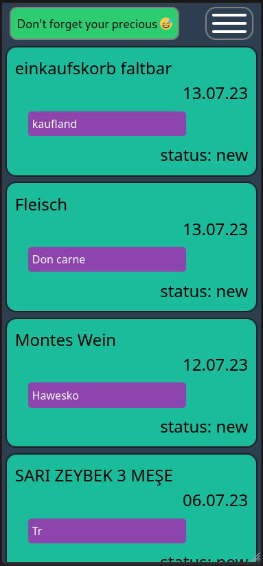
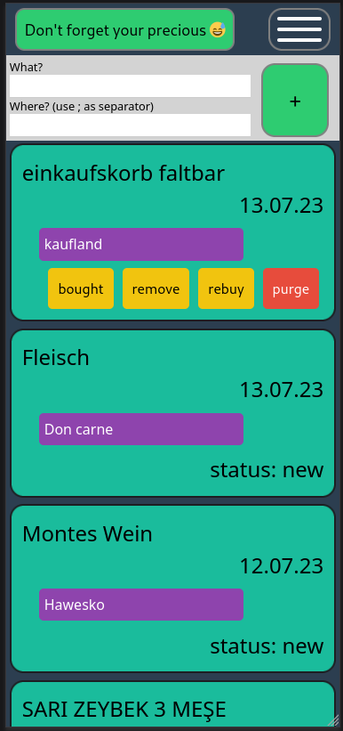

# DOFO - Don't forget your precious 😅️
Simple web based shopping list with json File backend

It's a pun. It started as "remember the cheese" but then I heard the song "Don't forget you're precious" by Alabaster Deblume.
So the name stuck.

Functionally the php/js code creates mobile first simple html interface where you can add and remove entries.
Those Entries can contain meta infos (don't know what to do with them atm) and can be de/activated and deleted.

Very handy. More for my families every day use. Just that I don't forget my precious shopping. 

# Install
Copy the 3 files index.php, main.js and style.css to a subfolder on your webserver.
